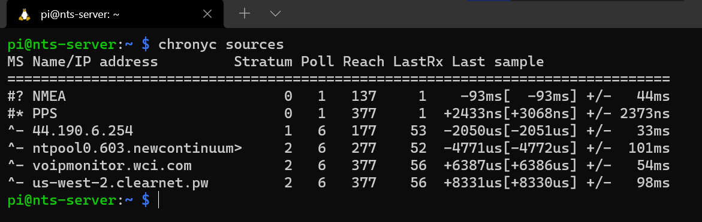
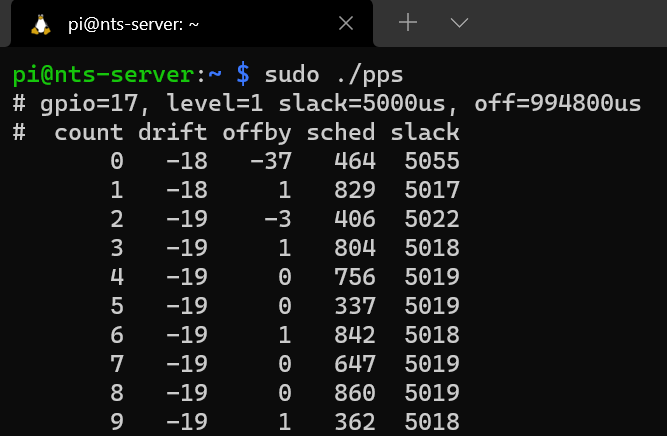
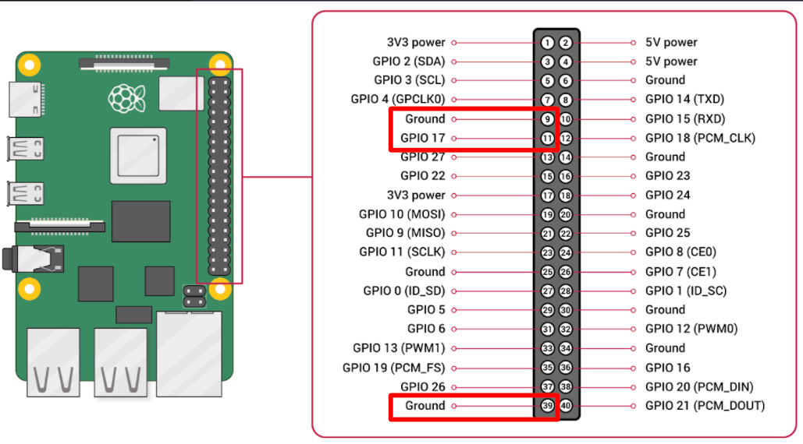

# rpi-nts-server
A tutorial on configuring a Raspberry Pi Based Stratum 1 (GPS fed) NTS Server using chrony

This server is intended to be located near a window, powered by PoE, feeding a Stratum 2 NTS server (public facing) located in a server room.
Self-signed certificates can be used to authenticate the local connection between these two servers, but you will want a properly signed cert for the public facing server.
This tutorial will focus on the Stratum 1 server, and show how to connect one client device as an example. We used another Raspberry Pi for simplicity. This client device could be replaced with your Stratum 2 server.  

# Server Hardware
1 x 4 GB Raspberry Pi 4B  
1 x Raspberry Pi 4 power supply  
1 x Raspberry Pi 4 case  
1 x Adafruit Ultimate GPS HAT for Raspberry Pi A+/B+/Pi 2/3/Pi 4 - Mini Kit  
1 x Active GPS antenna  
1 x PoE+ HAT  
1 x PoE+ Switch or injector  

## Notes
The external GPS antenna may not be required if signal is good enough on the antenna built into the HAT

# Example Client Hardware
1 x 4 GB Raspberry Pi 4B  
1 x Raspberry Pi 4 power supply  

# Software
## Raspberry Pi OS
A recent version of Raspberry Pi OS should be installed and set up on an SD card. Here is a nice tutorial from Raspberry Pi:  
https://projects.raspberrypi.org/en/projects/raspberry-pi-getting-started  
Repeat this for a separate SD card to be used with the client Pi.

Another distro, such as Ubuntu could be used as well, but this tutorial will focus on Raspberry Pi OS.
## gpsd
Follow this tutorial from Adafruit to configure your GPS HAT:  
https://learn.adafruit.com/adafruit-ultimate-gps-hat-for-raspberry-pi/

Essentially, gpsd will communicate with the GPS module over the serial link, interpret the NMEA sentences along with the PPS signal, and provide location and time information to other programs that request it.

We will need to pipe this data into chrony so that we can use it to serve accurate, precise time to clients.

## Install chrony
chrony 4.0 or later should be installed (4.0 added NTS support). Recent versions of Raspberry Pi OS or other distros should include this in the default repos.

Raspberry Pi OS includes NTPD by default. Installing chrony replaces this. Install chrony with:
```
sudo apt-get install chrony
```
Check the version with:
```
chronyc -v
```

Repeat these steps for the client Pi as well.

## Self-Signed Certificate
You will first need to install GnuTLS in order to use the certtool command. Install using:
```
sudo apt-get install gnutls-bin
```
This is a great resource on GnuTLS:
https://help.ubuntu.com/community/GnuTLS

The script [gen_certs.sh](gen_certs.sh) in the repo (also shown below) can be used to generate self-signed certificates suitable for NTS authentication with chrony.
```
#!/bin/bash
# Generate self-signed certificates for use with NTS and chrony

set -e

server_name=nts-server.local
cert=/etc/ssl/chrony_certs/nts.crt
key=/etc/ssl/chrony_certs/nts.key

rm -f $cert $key

cat > cert.cfg <<EOF
cn = "$server_name"
serial = 001
activation_date = "2020-01-01 00:00:00 UTC"
expiration_date = "2030-01-01 00:00:00 UTC"
signing_key
encryption_key
EOF

certtool --generate-privkey --key-type=ed25519 --outfile $key
certtool --generate-self-signed --load-privkey $key --template cert.cfg --outfile $cert
chmod 640 $cert $key
chown root:_chrony $cert $key

systemctl restart chronyd

sleep 3

chronyc -N authdata
```

Change the "server_name" to match the hostname you have set on your Raspberry Pi. This is important, as the name on the certificate must match your hostname. We used the ".local" suffix to allow for local discovery without using IP addresses.

https://en.wikipedia.org/wiki/.local

You may change where the certs are located, if desired. These locations are in the "cert" and "key" variables.
This script does:
1. Sets up a few variables for the hostname and location of private key and public certificate.
2. Removes the key and cert if they already exist.
3. Creates a certificate "template" with some important info filled in.
4. Invokes certtool to generate a private key using ed25519 algorithm.
5. Invokes certtool again to generate a public certificate using that private key.
6. Changes the permissions of the cert and key so that the owner can R/W, the group can R, and the world cannot access at all.
7. Change the owner to root and the group to _chrony. This is the group that chrony runs under.

 NOTE: On some systems this group may be different. Verify the group chrony runs under with:
 ```
 ps -aux | grep chrony
 ```
 
8. Restart the chrony service.
9. Pause 3 seconds. (wait for chrony to come back up)
10. Run the authdata command on chrony to see some NTS info.

You can download this script or copy and paste it into a file, naming it gen_certs.sh
In the directory where the script is stored, run the following commands to add executable permissions and execute the script as root:
```
chmod +x gen_certs.sh
sudo ./gen_certs.sh
```

If you print out these files, you should see something similar to:  


# Configure chrony (Server)
Make these changes to /etc/chrony/chrony.conf :  

```
###### below this line are custom config changes #######

# delay determined experimentally by setting noselect then monitoring for a few hours
# 0.325 means the NMEA time sentence arrives 325 milliseconds after the PPS pulse
# the delay adjusts it forward
refclock SHM 0 offset 0.569 delay 0 refid NMEA noselect poll 1
refclock PPS /dev/pps0 lock NMEA refid PPS poll 1

# Step the system clock instead of slewing it if the adjustment is larger than
# one second, but only in the first three clock updates.
makestep 1 5

# HW Clock as last resort
local stratum 10

# allow a single client on local network
allow 192.168.1.2

# NTS (SSL) Certificate and Key
ntsserverkey /etc/ssl/chrony_certs/nts.key
ntsservercert /etc/ssl/chrony_certs/nts.crt

###### above this line are custom config changes #######
```

Explanation of these changes:
1. Configure the interface between gpsd and chrony. SHM 0 is a "shared memory" channel between gpsd and chrony. The 0.569 delay represents the time between the NMEA sentence arriving via the serial link and the hard-wired PPS signal. This value needs to be roughly close to the actual delay so that chrony will accept the time source. Without this defined delay, chrony may mark the source as a "false ticker".
2. Configure the PPS signal which is mapped to a linux "device" on /dev/pps0
3. Allow the system clock to be stepped (large adjustment) in the first 5 clock updates. This will allow the clock to quickly synchronize on startup.
4. The local HW clock (driven by the oscillator on the RPi alone) will be labeled as Stratum 10 (very imprecise).
5. Allow only one IP to connect to this server. You may want to change this depending on your network setup.
6/7. Import the self-signed cert and key we made earlier. Change the directory here if you stored them somewhere else.

For more details on the format of the config file, read the chrony docs:
https://chrony.tuxfamily.org/doc/4.1/chrony.conf.html

Complete example config file for the server: [chrony_server.conf](chrony_server.conf)

Restart chrony with:
```
sudo systemctl restart chronyd
```

Verify that chrony is properly synchronized to the NMEA and PPS sources by running:
```
chronyc sources
```

You should see an output similar to:



Note the * in the "S" column. This indicates that chrony has chosen this source and is synchronized to it.

Check the chrony logs for errors with:

```
cat /var/log/syslog | grep chrony
```

If you see an error similar to: "error while setting credentials", this means chrony cannot read your key and/or certificate. This is likely a permissions issue. Go check the permissions on the directory tree leading to the key and cert as well as the key and cert files themselves.

If you don't see any concerning errors, you can (probably) assume that the server is ready to serve time using NTS.

# Configure chrony (Client)

At this point you should have the cert and key in the /etc/ssl/chrony_certs folder. Now you need to copy the cert to your client device (or Stratum 2 server). Do that using scp (ssh copy):

```
scp /etc/ssl/chrony_certs/nts.crt pi@nts-client1.local:/etc/ssl/chrony_certs
```

More info on scp command here:
https://linuxize.com/post/how-to-use-scp-command-to-securely-transfer-files/

Now, change config of client chrony to accept the cert and use NTS for the connection.

Make these changes to /etc/chrony/chrony.conf :  

```
###### below this line are custom config changes #######

server nts-server.local nts iburst minpoll 3 maxpoll 5
ntstrustedcerts /etc/ssl/chrony_certs/nts.crt

###### above this line are custom config changes #######
```

Explanation of these changes:
1. Configure the client to use your server as a time source. Make sure the domain name here matches the actual domain name as well as the domain name on the certificate. Note the "nts" option. This instructs chrony to make this connection using the nts standard.
2. Instruct chrony to trust the self-signed certificate that we generated and copied earlier. This is required since this cert was not signed by a certificate authority (CA). If you are using a CA signed cert, this line should not be neccessary. In that case, the cert should be automatically copied through the network and validated when the first connection is made.

Complete example config file for a client: [chrony_client.conf](chrony_client.conf)

Restart chrony and check the sources using the commands shown in the server section. You should see a similar output to:  


To verify that NTS is indeed being used for the connection, execute:
```
sudo chronyc -N authdata
```

You should see output similar to:


Note "NTS" in the "Mode" column. These three letters are hard-fought.

# Security Hardening
Since you are obviously security minded, it is also a good idea to secure your server in other ways. A big fancy lock on your front door does little good if your back window is open :)  

Here are some tuts on securing a Raspberry Pi:  

https://pimylifeup.com/raspberry-pi-security/  
https://raspberrytips.com/security-tips-raspberry-pi/  
https://makezine.com/2017/09/07/secure-your-raspberry-pi-against-attackers/  


# Testing
Once you have the server and client properly communicating via chrony and NTS, you can test the performance of the system. This can be done using pulse-per-second (PPS) generators on both the server and client.

Download "Pulse Per Second generator" from pigpio site:  
http://abyz.me.uk/rpi/pigpio/examples.html  

It is also duplicated in this repo for convenience:
[pps_c.zip](pps_c.zip)

Extract the code, compile, and run using these commands:
```
sudo apt-get install unzip build-essential
unzip pps_c.zip
cd pps_c
gcc -o pps pps.c -lpigpio
sudo ./pps -g 17
```
The last command will start the PPS generator on GPIO pin 17. See the pinout below for the location. Pressing CTRL-C will terminate the program. Sample output from this program is also shown below:

  



Repeat these steps for both the server and client.

Using an oscilloscope, you can measure the phase difference between these PPS signals. This is a measure of the sub-second accuracy of synchronization achieved.
# References
https://chrony.tuxfamily.org/faq.html  
https://chrony.tuxfamily.org/doc/4.0/chrony.conf.html  
https://gist.github.com/mlichvar/e6b183daa16599d7985dc81fdde7af39
